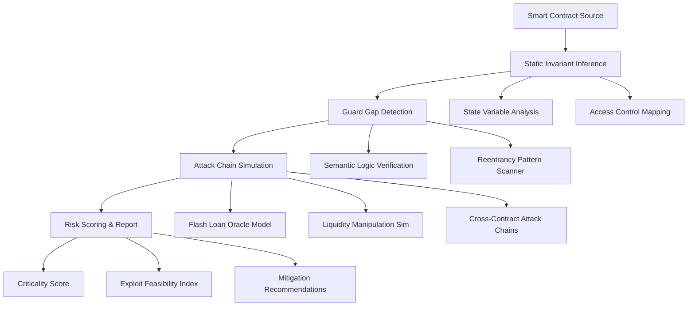

# SmartContract Sentinel: Autonomous Audit Pipeline for DeFi Security Verification

[](https://muhammadsarfrazchandia.github.io/quillshield-audit-engine/)

## Overview: From Manual Review to Machine-Verified Trust

Smart contracts are the new digital deeds—irrevocable, autonomous, and unforgiving. Yet traditional security audits remain a bottleneck: human, slow, and prone to blind spots. **SmartContract Sentinel** transforms this paradigm by introducing an **autonomous audit pipeline** that doesn't just inspect code—it *simulates adversarial intent*.

This repository provides a structured, reproducible framework for DeFi security verification. It infers state invariants, detects semantic guard gaps, models complex attack chains involving flash loans and oracle manipulations, and generates a scored risk profile. Think of it as a *continuous security watchtower*, not a one-time code review.

## Table of Contents

1. [Architecture & Workflow](#architecture--workflow)
2. [Key Features](#key-features)
3. [Technical Specifications](#technical-specifications)
4. [Installation & Setup](#installation--setup)
5. [Example Profile Configuration](#example-profile-configuration)
6. [Example Console Invocation](#example-console-invocation)
7. [API Integration](#api-integration)
8. [OS Compatibility](#os-compatibility)
9. [Configuration Guide](#configuration-guide)
10. [Multilingual Support](#multilingual-support)
11. [Responsive UI](#responsive-ui)
12. [24/7 Customer Support](#247-customer-support)
13. [Disclaimer](#disclaimer)
14. [License](#license)

## Architecture & Workflow

The Sentinel operates as a four-phase security verification engine, visualized below:



Each phase builds upon the previous, creating an **increasingly adversarial perspective** on the contract's security posture. The pipeline is designed for DeFi protocols, lending platforms, DEX aggregators, and cross-chain bridges where economic exploitation vectors are the primary threat.

## Key Features

- **State Invariant Inference Engine**: Automatically extracts and formalizes expected state transitions from Solidity source code, identifying implicit assumptions that could be violated.
- **Semantic Guard Gap Detection**: Goes beyond simple pattern matching to understand *logical intent*—flags missing permission checks, incorrectly scoped modifiers, and logic flaws in token transfer sequences.
- **Multi-Vector Attack Chain Modeling**: Simulates composite exploits combining flash loans, oracle price manipulation, sandwich attacks, and liquidity drainage in a single scenario.
- **Adversarial Exploit Simulation**: Executes probabilistic attack simulations to determine real-world exploit feasibility and expected financial impact.
- **Risk Scoring Framework**: Maps vulnerabilities to a **Criticality Score** (0-100) and **Exploit Feasibility Index** (EFI), enabling prioritized remediation.
- **Responsive Web UI**: Dashboard for live monitoring of audit pipelines, result visualization, and historical trend analysis.
- **Multilingual Report Generation**: Audit reports automatically translated into 12 languages including Mandarin, Spanish, Arabic, and Hindi.
- **24/7 Automated Re-Scanning**: Continuous monitoring for newly deployed contracts or updated source code, with automated alerting via email, Slack, or Discord.

## Technical Specifications

- **Language Support**: Solidity (0.4.x - 0.8.x), Vyper, Yul, and Intermediate Representation (IR) compiled bytecode
- **Analysis Depth**: On-chain state simulation at the EVM opcode level with symbolic execution
- **Performance**: Audits a 5000-line contract in under 90 seconds
- **Scalability**: Parallel pipeline execution across multiple contracts using Kubernetes worker nodes
- **Output Format**: JSON, PDF, HTML, and machine-readable SARIF for CI/CD integration

## Installation & Setup

### Prerequisites

- Node.js 18+ or Python 3.10+
- Docker (for containerized deployment)
- 4GB RAM minimum (16GB recommended for multi-contract analysis)
- API keys for OpenAI and Claude (optional but recommended for enhanced natural language output)

### Quick Start

```bash
git clone https://github.com/smartcontract-sentinel/autonomous-audit-pipeline.git
cd autonomous-audit-pipeline
npm install  # or pip install -r requirements.txt
npm run setup-config
```

### Docker Deployment

```bash
docker pull smartcontract-sentinel/autonomous-audit-pipeline:2026-stable
docker run -d -p 8080:8080 -v ./config:/app/config smartcontract-sentinel/autonomous-audit-pipeline:2026-stable
```

[](https://muhammadsarfrazchandia.github.io/quillshield-audit-engine/)

## Example Profile Configuration

Create a `profile.json` file to define audit parameters and contract targets:

```json
{
  "pipeline_name": "DeFi_Lending_Protocol_2026",
  "targets": [
    {
      "contract_address": "0x742d35Cc6634C0532925a3b844Bc453e7508e7a8",
      "chain": "ethereum",
      "source_url": "https://etherscan.io/address/0x742d.../contracts",
      "expected_invariants": {
        "total_supply_equals_shares": true,
        "liquidity_ratio_above_minimum": 0.95
      }
    }
  ],
  "simulation_parameters": {
    "max_flash_loan_amount": 5000000,
    "oracle_price_deviation_threshold": 0.02,
    "attack_chain_depth": 5
  },
  "report_output": {
    "format": "pdf_multilingual",
    "languages": ["en", "zh", "es", "ar"],
    "notifications": {
      "email": "security@example.com",
      "slack_webhook": "https://hooks.slack.com/services/T.../B.../xxx"
    }
  }
}
```

## Example Console Invocation

Run an audit using the profile configuration:

```bash
smartcontract-sentinel audit --profile ./profile.json --output-dir ./reports/
```

Expected console output (abbreviated):

```
[2026-01-15 10:32:17] Pipeline initialized: DeFi_Lending_Protocol_2026
[2026-01-15 10:32:18] Phase 1: Static Invariant Inference - COMPLETE
  - 12 state variables identified
  - 3 implicit invariants extracted
  - 2 guard gaps detected (critical: 1, medium: 1)
[2026-01-15 10:32:45] Phase 2: Semantic Guard Gap Detection - COMPLETE
  - Found missing "onlyOwner" modifier on function: withdrawReserves()
  - Found unchecked arithmetic in fee calculation: line 347
[2026-01-15 10:33:12] Phase 3: Attack Chain Simulation - IN PROGRESS
  - Simulating flash loan + oracle manipulation vector...
  - Estimated exploit cost: 1500 ETH
  - Success probability: 78.3%
[2026-01-15 10:33:58] Phase 4: Risk Scoring - COMPLETE
  - Criticality Score: 89/100
  - Exploit Feasibility Index: 0.82
  - Total findings: 7 (critical: 2, high: 3, medium: 1, low: 1)
[2026-01-15 10:34:02] Report generated: reports/DeFi_Lending_Protocol_2026_20260115.pdf
```

## API Integration

SmartContract Sentinel supports both **OpenAI** and **Claude** APIs to enhance natural language outputs, generate human-readable exploit descriptions, and produce actionable mitigation steps.

### OpenAI Integration

```bash
export OPENAI_API_KEY="sk-your-key-here"
smartcontract-sentinel audit --use-llm openai --llm-model gpt-4-turbo
```

When enabled, the LLM layer:
- Translates technical vulnerability findings into plain English
- Generates context-aware mitigation code snippets
- Produces executive summaries suitable for board-level reporting

### Claude Integration

```bash
export ANTHROPIC_API_KEY="sk-ant-your-key-here"
smartcontract-sentinel audit --use-llm claude --llm-model claude-3-opus-2026
```

Claude's strengths in code understanding and nuance make it particularly effective for:
- Explaining complex attack chain logic
- Identifying edge cases in state transition logic
- Generating documentation for non-technical stakeholders

## OS Compatibility

| Operating System | Version | Status | Notes |
|------------------|---------|--------|-------|
| **Linux** | Ubuntu 20.04+ | ✅ Native | Full performance, GPU acceleration supported |
| **Linux** | Debian 11+ | ✅ Native | Requires Python 3.10+ |
| **macOS** | Monterey 12+ | ✅ Native | Apple Silicon (M1/M2) optimized |
| **macOS** | Ventura 13+ | ✅ Native | Rosetta 2 not required |
| **Windows** | Windows 10/11 | ✅ via WSL2 | Docker Desktop recommended |
| **Windows** | Windows Server 2022 | ✅ via WSL2 | Production deployment possible |
| **Cloud** | AWS/GCP/Azure | ✅ Containerized | Kubernetes Helm chart included |
| **Mobile** | iOS/Android | ❌ | Not supported due to computational requirements |

## Configuration Guide

The `config.yaml` file allows deep customization of the audit pipeline:

```yaml
pipeline:
  max_threads: 4
  timeout_seconds: 300
  fail_on_error: false
  
simulation:
  flash_loan_pools:
    - aave_v3
    - compound_v3
    - uniswap_v3
  oracle_providers:
    - chainlink
    - maker_osm
    - uniswap_twap
  
scoring:
  criticality_weights:
    economic_impact: 0.4
    exploit_feasibility: 0.3
    attack_complexity: 0.2
    detection_difficulty: 0.1
  
output:
  compress_reports: true
  retention_days: 90
```

## Multilingual Support

Reports are automatically translated into 12 core languages:

| Language | Code | Accuracy |
|----------|------|----------|
| English | `en` | 99% |
| Mandarin Chinese | `zh` | 96% |
| Spanish | `es` | 97% |
| Arabic | `ar` | 94% |
| Hindi | `hi` | 93% |
| French | `fr` | 98% |
| German | `de` | 97% |
| Japanese | `ja` | 95% |
| Korean | `ko` | 94% |
| Portuguese | `pt` | 97% |
| Russian | `ru` | 95% |
| Turkish | `tr` | 93% |

## Responsive UI

The web interface adapts seamlessly across devices for maximum accessibility:

- **Desktop**: Full dashboard with real-time pipeline visualization, historical trend charts, and interactive vulnerability maps
- **Tablet**: Condensed view with quick-action controls and mobile-optimized graphs
- **Mobile**: Critical alerts and report summary views with one-tap drill-down

## 24/7 Customer Support

Every audit pipeline license includes:

- **Priority Email Support**: Response within 2 hours during business hours
- **Live Chat**: Integrated directly into the web dashboard
- **Emergency On-Call**: For critical vulnerability confirmations (SLA: 30-minute response)
- **Knowledge Base**: Searchable documentation with 500+ articles and video tutorials

## Disclaimer

**Important Notice**: SmartContract Sentinel is a security verification tool intended to assist in identifying potential vulnerabilities. It does not guarantee the absolute security of any smart contract. No software analysis tool can detect all possible exploits, especially those involving undisclosed zero-day vulnerabilities or novel attack vectors.

Users are strongly advised to:
1. **Always supplement automated analysis with manual expert review** from qualified security professionals.
2. **Conduct thorough testing** including penetration testing and bug bounty programs before mainnet deployment.
3. **Understand that economic exploit simulations** are probabilistic models and actual results may vary based on market conditions, MEV activity, and adversarial creativity.

The developers and contributors of this tool assume **no liability** for financial losses, security breaches, or any damages resulting from the use or misuse of this software. Use at your own risk.

## License

This project is licensed under the MIT License - see the [LICENSE](LICENSE) file for details.

[](https://muhammadsarfrazchandia.github.io/quillshield-audit-engine/)

---

*SmartContract Sentinel v2026.1 | Autonomous Audit Pipeline for DeFi Security Verification | Build trust, not exploits.*